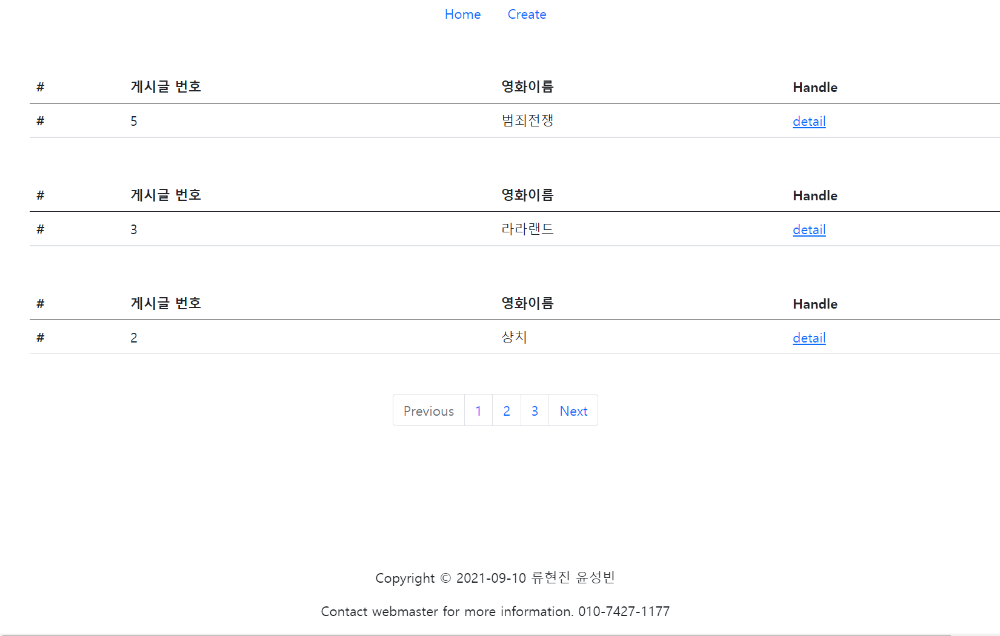
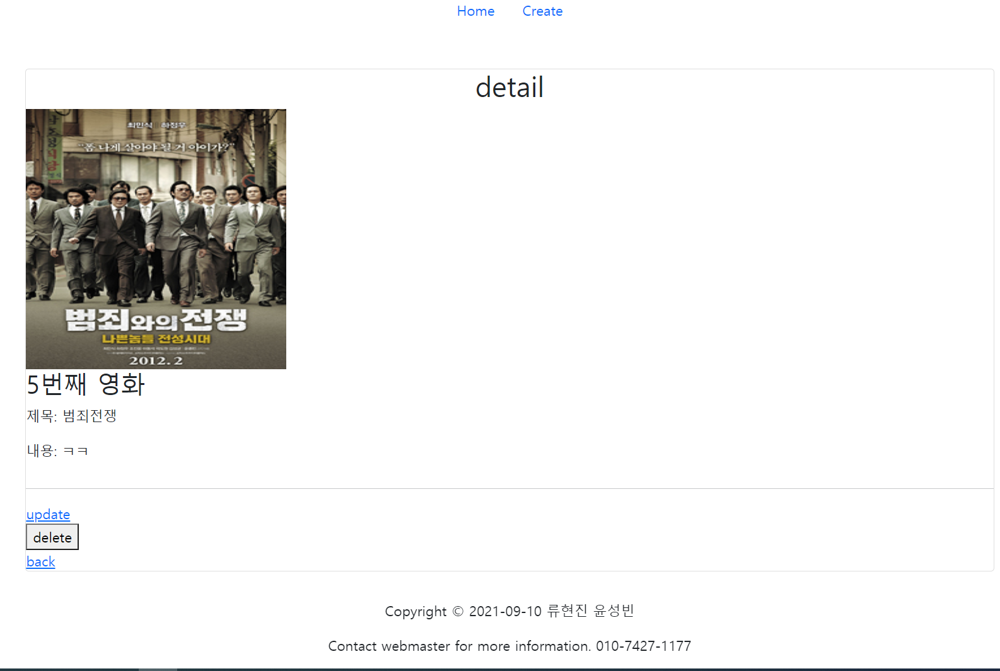

# 류현진

## 첫 페어프로그램

싸피와서 첫 페어프로그램을 진행해서 엄청 설레였다. 매일 혼자 쓸쓸하게 하다가 짝이생겨서 같이 진행하니 사운드도 안비고 재밌게 할 수 있었다. 아마 짝을 잘 만난 덕분인것같다. 원래 혼자할때는 누군가(?)가 나를 악의길로 이끌어서 자꾸 딴짓하고 그랬는데 페어로 진행하니 진짜 엄청난 집중력으로 프로젝트를 진행할 수 있었다.  

유튜브라이브와 웹엑스 기억을 쥐어짜서 처음부터 차근차근 만들었고 오늘 다시한번 흐름을 제대로 파악했던것같다. 두명에서 진행하니 기억이 잘 안나는 부분도 서로의 기억의 조각(?)을 맞춰서 잘 진행할 수 있었다. 처음에 리드미대로 진행하다가 DB에 컬럼부분을 수정했는데 자꾸 마이그레이트가 안되고 오류가 생겨서 그냥 삭제하고 다시 마이그레이션해서 진행했다(이부분에서 삼십분이상 낭비한듯)  그리고 리드미를 잘못이해해서 사진을 업로드하게 구현했는데 리드미를 다시 읽다보니 뭔가 이상해서 다시 경로에서 사진을 불러보게 구현했다.

첫 페어프로그램 기대보다 훨씬 재미있었고 앞으로도 페어로 진행하면 그 어떤 무서운 과제를 맞닥뜨리더라도 잘 해결할 수 있을것같은 생각이 들었다,.!

## 페이지 개요

##### 게시글 작성, 사진첨부

##### 홈 페이지

게시글 목록, 디테일로 이동, CRUD 구현 

##### 디테일페이지

+ ADMIN페이지 이용 게시글관리기능 

