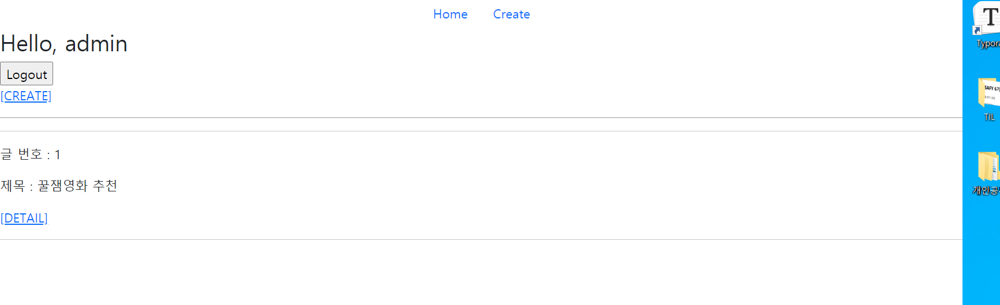
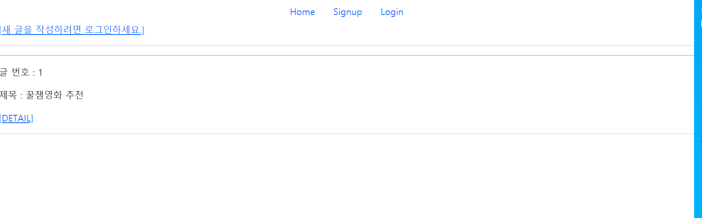
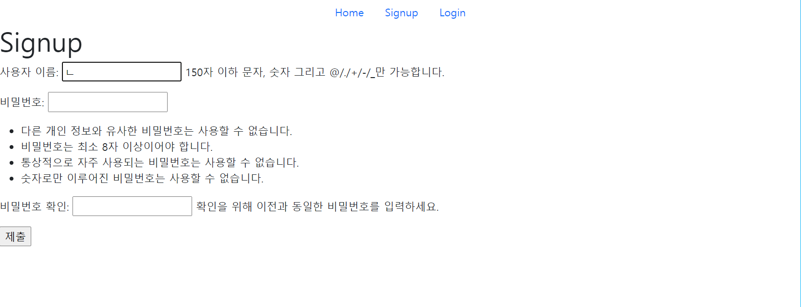
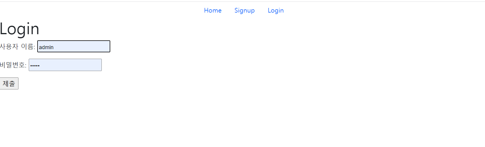

# 210917 pjt06 README


### 페어링 진행

깃으로 브랜치 생성해서 버전관리하는 방법을 배웠으나 아직 익숙치않아서 저번주와 동일하게 네비-드라이버 역할로 페어활동을 진행했다.

#### 진행과정

nav : 성빈

driver : 현진

`가상환경 설정` > `gitlab 프로젝트와 연결` > `pjt06 project 생성` > `서버 확인` > `community`\ `accounts` app 생성 > `urls.py` 설정 > `models.py` 생성 > `makemigrations` `migrate` > `admin` 생성 > `views.py`작성 >  `templates/base.html` 작성 > `templates/community/..html` 필요한 html 생성  

----

nav : 현진

driver : 성빈

`urls.py` 작성 > `templates\accounts` login.html , signup.html 작성 > `views.py` 작성 > 서버 확인해보면서 연결이 안되거나, 추가적으로 설정해야하는 기능들을 작성


#### 어려웠던 부분

1. 로그인이 되어있지않은 상태에서 새로운 글 작성이 되면 안되어야한다.

   ```djan
   
       <a href="">[CREATE]</a>
     
       <a href="">[새 글을 작성하려면 로그인하세요.]</a>
     
     <hr>
     <hr>
     
       <p>글 번호 : {{ movie.pk }}</p>
       <p> 제목 : {{ movie.title }}</p>
       <a href="">[DETAIL]</a>
       <hr>
     
   ```

   if 인증되지않은 사용자이면 create에 접근하지 못하게 if문을 넣어서 해결했다.

2. 로그인하고 작성한 글을 수정하려고하면 url 연결이 안되고 noreversematch 오류 발생

   ```django
   @login_required
   @require_http_methods(['GET', 'POST'])
   def update(request, pk):
       movie = get_object_or_404(Community, pk=pk)
       if request.method == 'POST':
           form = CommunityForm(request.POST, instance=movie)
           if form.is_valid():
               form.save()
               return redirect('community:detail', movie.pk)
       else:
           form = CommunityForm(instance=movie)
       context = {
           'movie': movie,
           'form': form,
       }
       return render(request, 'community/update.html', context)
   ```

   movie 부분에 community로 작성되어있었다. update 부분은 전체 목록을 보는게 아니고

   수정하고자 하는 하나의 글만 봐야하니까 movie로 고쳤더니 해결했다.


#### 느낀점

**성빈** :

우연히 저번주에 함께했던 페어와 또 같이 하게되었는데, 한번 호흡을 맞추어봐서 그런지 이번 프로젝트는 저번보다 더 수월하게 진행되었다. 나는 crud 부분이 좀 더 명확하게 알고있어서 프로젝트 앞 부분을 맡아서 진행했고, 페어는 로그인,회원가입 등 계정에 관한부분을 맡아서 진행했다.

그렇다고 아예 맡은부분을 나눠서 처리한게 아니고 오류가 발생하면 함께 고민하며 해결해서 더 수월하고 빠른 진행을 할 수 있었다.


**현진** :

저번주 내용과 거의 비슷했지만 account/ 인증.로그인,로그아웃 부분이 추가된 과제였다. 한시간씩 돌아가면 비효율적일것같아서 내가 account부분을 네비하고 내 페어가 community를 네비하는식으로 진행하였다. 저번보다 양이 많아졌지만 시간도 넉넉해서 그렇게(?) 어렵진 않았던것같다.. 하지만 다다음주에있을 월말평가가 심히 격정이 된다. 하나도안보고 어떻게 할지 너무 막막하다.. 공부야 열심히 해보겠지만 자신이없다...하지만 열심히 노력해야겠다.


기능구현


홈화면 (로그인구현)









인증시 게시글 작성가능하게 account 구현.
