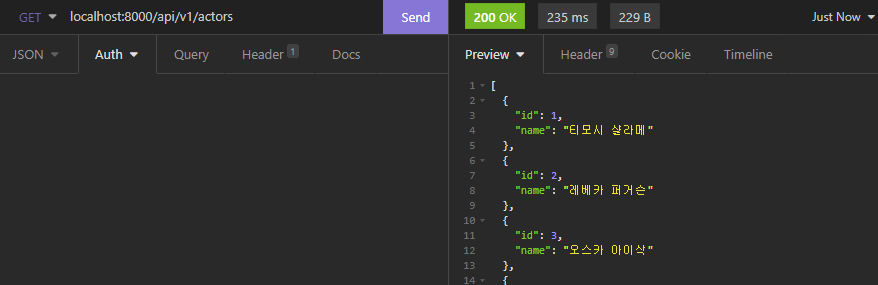
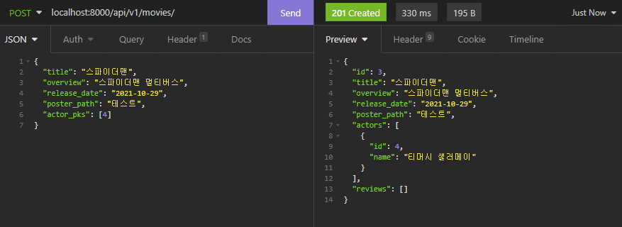
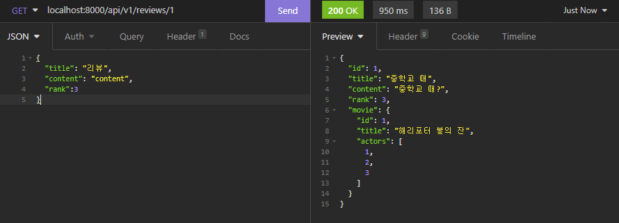
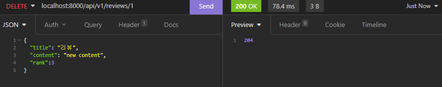

# PJT 08

## 영화 정보 제공 API

#### 요구사항

 커뮤니티 서비스의 상세 기능 개발을 위한 단계로, 모델간의 관계 설정 후 데이터의 생성, 조회, 수정, 삭제할 수 있는 기능을 완성합니다. 데이터의 조회는 JSON 양식을 따릅니다.

데이터 모델링시 현실의 모든 정보를 제공할 수 없으므로 제공할 데이트를 정제하여 제공해야 한다.

ERD의 명세에 따라서 프로젝트를 진행하였다.

직렬화 과정에서 외부에 데이터 선언을 해줬는데 각 데이터간에 연속적인참조가 나면서 DB반영이 되지 않았고

내부에 Class선언 해줘서 다시 설정해줬는데 정상적으로 작동했다.

---

### API 동작 

### actor

#### `actors/`

#### `actors/<int:actor_pk>`

### movies

#### `movies/`

#### `movies/<int:movie_pk>`

### reviews

#### `reviews`

#### `movies/<int:movie_pk>/reviews/`

#### `reviews/<int:review_pk>`

