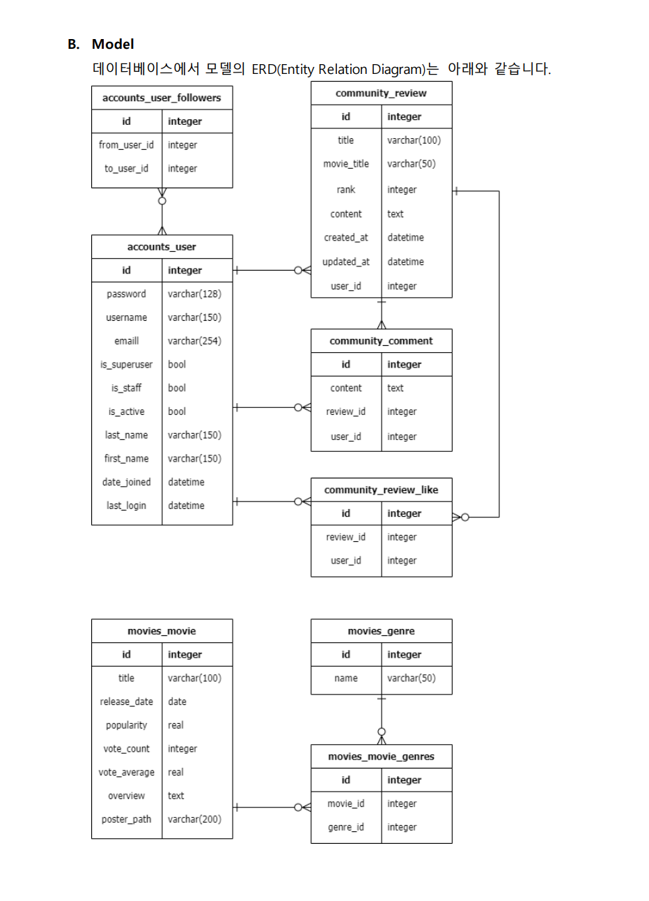
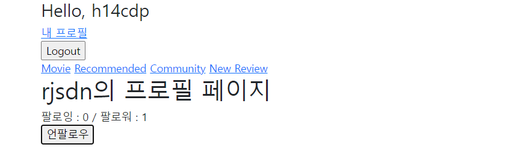
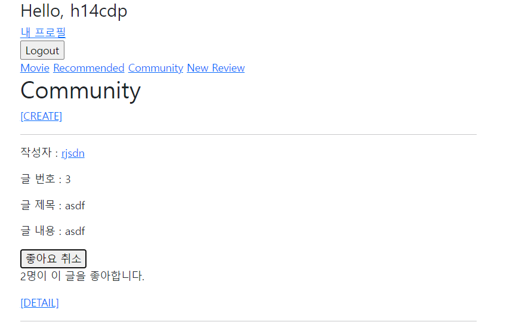
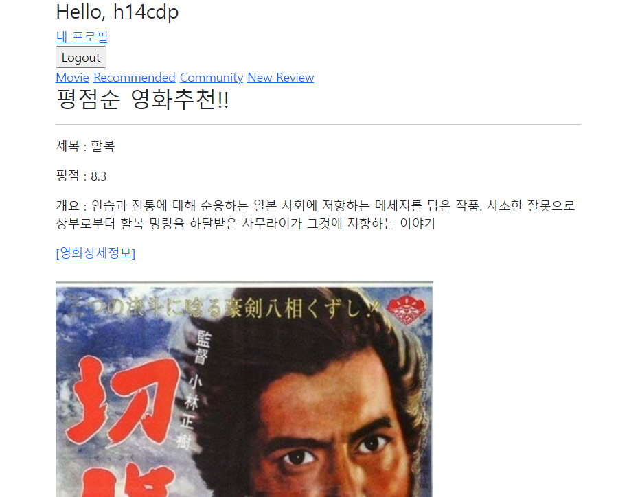

# pjt09

#### 요구사항 커뮤니티 서비스의 상세 기능 개발을 위한 단계로, 비동기 통신(AJAX)을 활용하여 사 용자의 UI/UX를 개선합니다.


### Model




####  유저 팔로우 기능

##### - 팔로우 버튼을 클릭하는 경우, AJAX통신을 이용하여 서버에서 JSON데이 터를 받아와 상황에 맞게 HTML화면을 구성




```python
@require_POST
def follow(request, user_pk):
    if request.user.is_authenticated:
        me = request.user
        you = get_object_or_404(get_user_model(), pk=user_pk)
        if me != you:
            if you.followers.filter(pk=me.pk).exists():
                you.followers.remove(me)
                isFollowed = False
            else:
                you.followers.add(me)
                isFollowed = True
            context = {
                'isFollowed': isFollowed,
                'followers_count': you.followers.count(),
                'followings_count': you.followings.count(),
            }
            return JsonResponse(context)
        return redirect('accounts:profile', you.username)
    return redirect('accounts:login')

```


#### 프로필

```HTML



  <h1>{{ person.username }}의 프로필 페이지</h1>
  
    <div id="follow-count">
      <div>
        팔로잉 : {{ followings|length }} / 팔로워 : {{ followers|length }}
      </div>
      
        <div>
          <form id="follow-form" data-user-id="{{ person.pk }}">
            
            
              <button id="followBtn">언팔로우</button>
            
              <button id="followBtn">팔로우</button>
            
          </form>
        </div>
      
    </div>
  



  <script>
    const form = document.querySelector('#follow-form')
    const csrftoken = document.querySelector('[name=csrfmiddlewaretoken]').value

    form.addEventListener('submit', function (event) {
      event.preventDefault()

      const userId = event.target.dataset.userId

      axios({
        method: 'post',
        url: `http://127.0.0.1:8000/accounts/${userId}/follow/`,
        headers: {'X-CSRFToken': csrftoken},
      })
        .then(response => {
          const followBtn = document.querySelector('#follow-form > button')
          const isFollowed = response.data.isFollowed
          const followers_count = response.data.followers_count
          const followings_count = response.data.followings_count
          const followCountDiv = document.querySelector('#follow-count > div')

          if (isFollowed === true) {
            followBtn.innerText = '언팔로우'
          } else {
            followBtn.innerText = '팔로우'
          }

          followCountDiv.innerText = `팔로잉 : ${followings_count} /  팔로워 : ${followers_count}`
        })
    })


  </script>

```


#### 리뷰 좋아요 기능

#####  - 좋아요 버튼을 클릭하는 경우, AJAX통신을 이용하여 서버에서 JSON데이 터를 받아와 상황에 맞게 HTML화면을 구성합니다.





```python
@require_POST
def like(request, review_pk):
    if request.user.is_authenticated:
        review = get_object_or_404(Review, pk=review_pk)
        if review.like_users.filter(pk=request.user.pk).exists():
            review.like_users.remove(request.user)
            liked = False
        else:
            review.like_users.add(request.user)
            liked = True
        context = {
            'liked': liked,
            'count': review.like_users.count(),
        }
        return JsonResponse(context)
    return redirect('accounts:login')
```


####  영화 추천 기능

##### 사용자가 인증되어 있다면, 알고리즘을 활용하여 10개의 영화를 추천하여 제공합니다.

##### -> 인증된 사용자에게 평점순으로 10개의 추천 영화를  recomended 페이지에 제공.




```python
@require_safe
def recommended(request):
    movies = Movie.objects.order_by('vote_average')[:10]
    context = {
        'movies': movies,
    }
    return render(request, 'movies/recommended.html', context)
```


```html



  <h2>평점순 영화추천!!</h2>
  <hr>
  
    <p>제목 : {{ movie.title }}</p>
    <p>평점 : {{ movie.vote_average }}</p>
    <p>개요 : {{ movie.overview }}</p>
    <a href="">[영화상세정보]</a>
    <br>
    <br>
    
    <hr>
  
  <a href="">[back]</a>
  <hr>



```


#### 추후에 최종 프로젝트시 고려할 아이디어:

##### 알고리즘 구현시 회원가입시 좋아하는 장르를 몇개 선택한 후 해당장르중 평점과 댓글수, 좋아요수를 점수화하여 합산한 후  사용자에게 10개의 추천 영화를 제공


# 느낀점

#### 노건우

##### 벌써 9번째 프로젝트를 마치게 되었습니다. 이번에는 스켈레톤 코드가 있어서 저 번주보다 일사천리로 처리되었습니다. 알고리즘을 이용하여 추천 목록을 작성하려했지만 거기까지 하기엔 시간이 부족해서 구현은 못했지만 다음 관통프로젝트때는 꼭 구현할 수 있도록 하겠습니다.


#### 류현진

##### 데이터모델링을 직접할 필요가 없어서 시간이 많이 단축되었고 AJAX통신을 이용한 JSON데이터를 받아오는 구조에 상당히 익숙해 진것 같습니다. 시간이 부족하여 알고리즘구현을 간단하게 하였지만 페어와 추후 적용할 알고리즘에 대하여 심도있게 토론하는 시간을 가졌습니다. 

